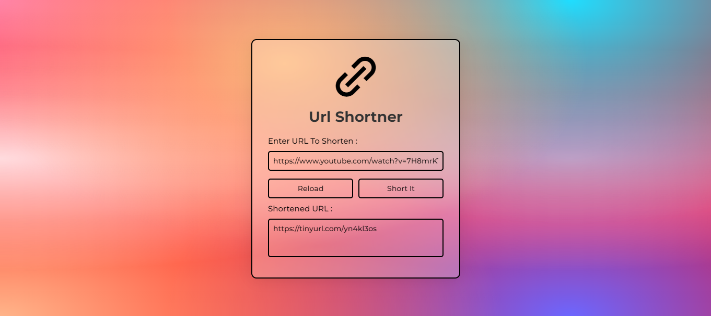

URL Kısaltıcı Uygulama
Bu URL kısaltıcı uygulaması, uzun URL'leri daha kısa bir formda temsil etmek ve bu kısaltılmış URL'leri oluşturmak için kullanabileceğiniz bir JavaScript uygulamasını içerir.

URL Kısaltıcı

Nasıl Kullanılır?
Uygulamayı başlatma: Uygulamayı tarayıcınızda açın veya bir web sunucusunda barındırın.

Uzun URL Girin: Ana sayfada, ayrılmak istediğiniz uzun URL'yi "Uzun URL girin..." metin giriş yazın.

URL'yi Kısaltın: "Kısalt" düğmesine tıklayarak, girilen uzun URL'yi kısaltın.

Kısaltılmış URL'yi Kopyalayın: Kısaltılmış URL, "Kısaltılmış URL" alanında görüntülenecektir. Bu URL'yi kopyalayabilir ve paylaşabilirsiniz.

Nasıl Çalışır?
Bu URL kısaltıcı uygulaması aşağıdaki temel bileşenleri içerir:

HTML ve CSS : Kullanıcı tanımlarını oluşturmak için HTML ve CSS kullanılmıştır. Kullanıcılar uzun URL'yi alabilir ve kesintilerini başlatabilirler.

JavaScript : JavaScript, kullanıcının girdiği uzun URL'yi alır ve bir azaltma mantığı kullanarak kısaltılmış URL'yi oluşturur. Bu örnekte, basit bir rastgele değişim mantığı kullanılmıştır. Daha karmaşık bir uygulama için gerçek bir URL uzatma hizmeti API'si mevcuttur.

Uygulamanın Geliştirilmesi
Eğer bu uygulamayı yaparsanız, aşağıda belirtilenler gerçekleşir:

Gerçek Bir URL Kısaltma Hizmeti Kullanımı : Daha güçlü ve güvenilir bir URL uzatma hizmeti kullanmak için sunucu tarafında bir API'yi çıkarabilirsiniz.

Kullanıcı Doğrulama : Uygulamanızı daha güvenli hale getirmek için Kullanıcı kimlik doğrulaması ile yönlendirebilirsiniz.

Veritabanı Yönetimi : Kısaltılmış URL'leri ve ilgili uzun URL'leri takip etmek için bir veri tabanını kullanabilirsiniz.

URL İstatistikleri : Kısaltılmış URL'lerin ne kadar sık ​​kullanımı izlemek için istatistikler sunulabilir.

Kullanıcı Dostu Hatalar : Kullanıcıların hata durumlarını daha iyi anlamalarını sağlamak için hata mesajlarını görebilirsiniz.

Bu README belgesi, temel kullanımın toplanması ve uygulanması çalışma kurallarının kuralları için tasarlanmıştır. Uygulamayı genişletirken veya başka bir kişi sunarken bu açıklamaları güncellemeyi unutmayın. Daha fazla bilgi için LİSANS parçalarını inceleyin.

Bu uygulama ile keyifli çalışmalar!

